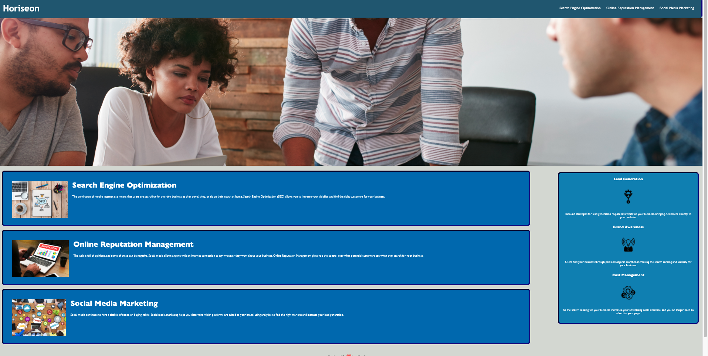

# Week1-Homework

The Homework for the first week of the coding bootcamp was to refactor the existing code for the Horiseon webpage. This involved consolidating the existing html and css files into more concise and accessible code. 

Both the CSS and HTML files have been commented to highlight every change that has been made to the code.

Below is a screenshot of the webpage.

This is the URL link to the deployed webpage https://danpadge16.github.io/Week1-Homework/

    
    
